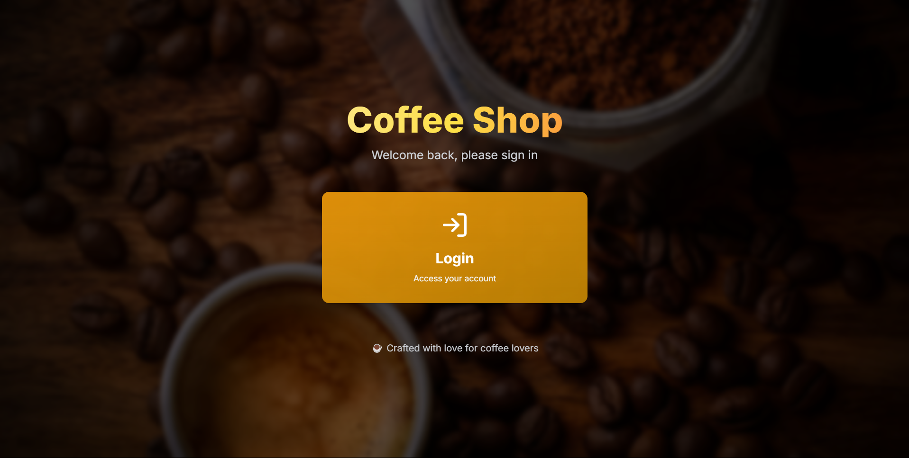
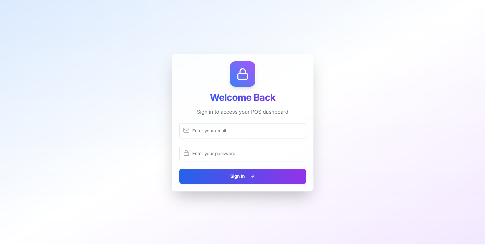
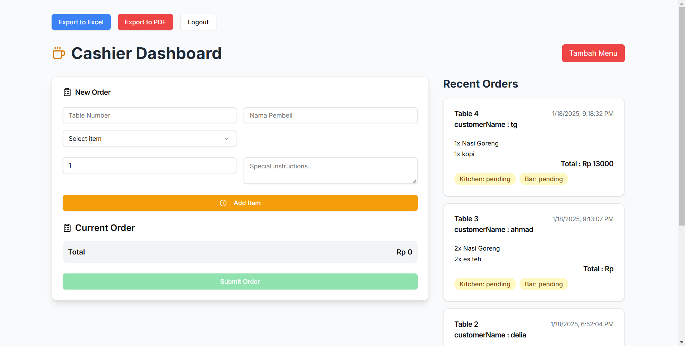
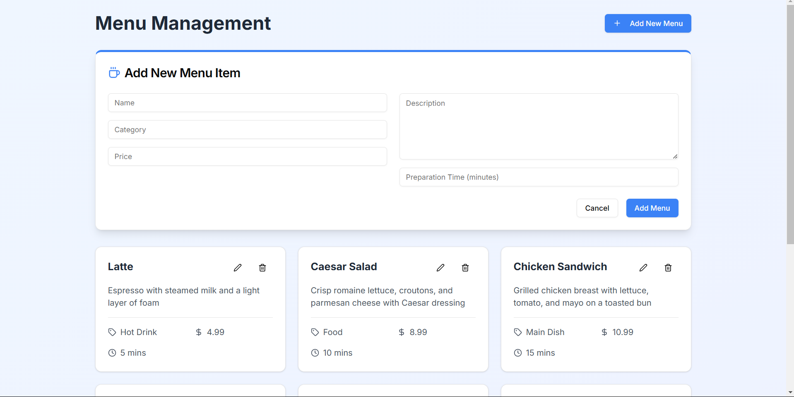
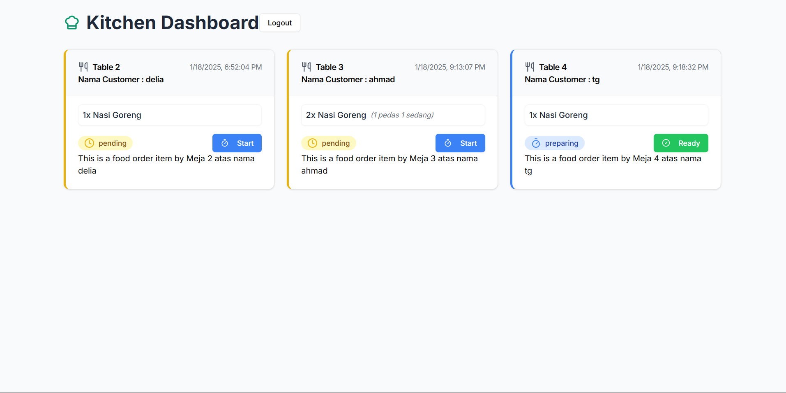
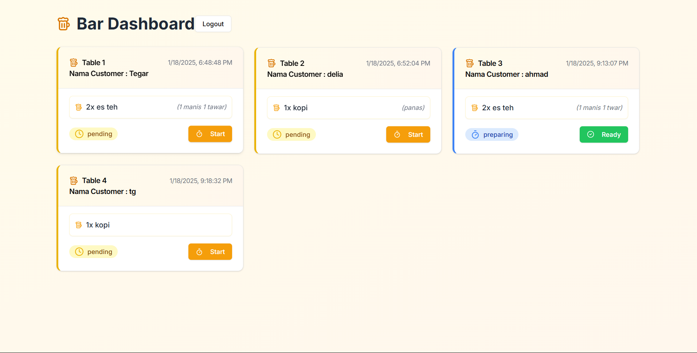
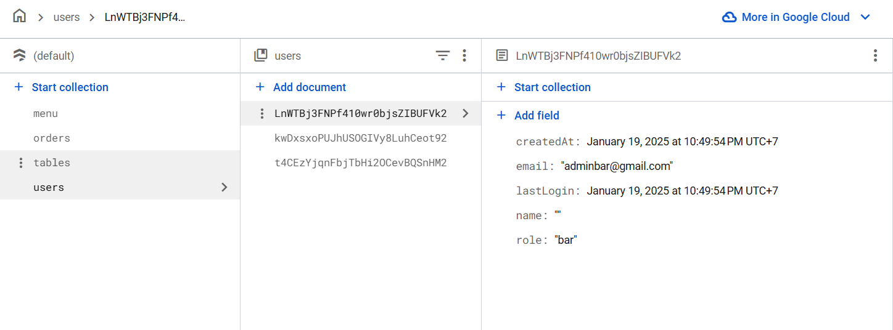

# POS Coffee Shop


## 🚀 Deskripsi Proyek

POS Coffee Shop adalah aplikasi manajemen pemesanan untuk coffee shop modern. Website ini membantu mengelola pemesanan dari pelanggan hingga proses penyajian, memastikan pesanan dikelola sesuai dengan divisi masing-masing (Dapur dan Bar). Kasir dapat memantau status pesanan secara real-time, dan laporan pemesanan dapat diekspor dalam format Excel dan PDF.

## 🛠️ Teknologi yang Digunakan

- **Next.js**: Framework React untuk pengembangan front-end.
- **Firebase**: Backend-as-a-Service untuk autentikasi dan database real-time.
- **ShadCN UI**: Komponen UI modern yang elegan.
- **Framer Motion**: Animasi interaktif untuk pengalaman pengguna yang menarik.

---

## ⚙️ Fitur Utama

1. **Manajemen Pemesanan**  
   - Pelanggan melakukan pemesanan ke kasir.
   - Kasir menginputkan pesanan ke sistem.
   - Pesanan otomatis dikirim ke divisi terkait:
     - **Dapur** untuk pesanan makanan.
     - **Bar** untuk pesanan minuman.

2. **Update Status Pesanan**  
   - Status default: `Belum Disiapkan`.
   - Divisi terkait dapat mengubah status menjadi:
     - `Sedang Diproses` saat pesanan sedang disiapkan.
     - `Selesai` saat pesanan sudah selesai.
   - Kasir dapat memantau status pesanan secara **real-time**.

3. **Rekapan Pemesanan**  
   - Kasir dapat mengunduh laporan pemesanan dalam format **Excel** dan **PDF**.

4. **Multi-Auth Login**  
   - Login sesuai role:
     - **Kasir**: Mengelola pemesanan.
     - **Dapur**: Mengelola pesanan makanan.
     - **Bar**: Mengelola pesanan minuman.
   - Role diarahkan ke dashboard masing-masing setelah login.

---

## 🎮 Demo Website

### Akun untuk Uji Coba
1. **Login Kasir**:  
   - Email: `adminkasir@gmail.com`  
   - Password: `Adminkasir123`
2. **Login Dapur**:  
   - Email: `admindapur@gmail.com`  
   - Password: `AdminDapur123`
3. **Login Bar**:  
   - Email: `adminbar@gmail.com`  
   - Password: `AdminBar123`

---

## 📦 Instalasi dan Konfigurasi

1. Clone repository ini:
   ```bash
   git clone https://github.com/username/pos-coffee-shop.git
   ```
2. Masuk ke folder proyek:
   ```bash
   cd pos-coffee-shop
   ```
3. Install dependencies:
   ```bash
   npm install
   ```
4. Buat file `.env.local` dan tambahkan konfigurasi Firebase Anda:
   ```env
   NEXT_PUBLIC_FIREBASE_API_KEY=your-api-key
   NEXT_PUBLIC_FIREBASE_AUTH_DOMAIN=your-auth-domain
   NEXT_PUBLIC_FIREBASE_PROJECT_ID=your-project-id
   NEXT_PUBLIC_FIREBASE_STORAGE_BUCKET=your-storage-bucket
   NEXT_PUBLIC_FIREBASE_MESSAGING_SENDER_ID=your-messaging-sender-id
   NEXT_PUBLIC_FIREBASE_APP_ID=your-app-id
   ```
5. Jalankan aplikasi:
   ```bash
   npm run dev
   ```
6. Akses aplikasi di [http://localhost:3000](http://localhost:3000).

---

## ✨ Screenshots

**Halaman Landing Page**  


**Halaman Login**


**Dashboard Kasir**  


**Kasir Tambah Menu**  


**Dashboard Dapur**  


**Dashboard Bar**  


**Dashboard Kasir**  


**Collection Firestore**  


---

## 🛡️ Lisensi

Proyek ini dilisensikan di bawah [MIT License](LICENSE).

---

## 🤝 Kontribusi

Kami sangat terbuka untuk kontribusi! Jika Anda ingin berkontribusi:

1. Fork repository ini.
2. Buat branch baru untuk fitur Anda:
   ```bash
   git checkout -b fitur-anda
   ```
3. Commit perubahan Anda:
   ```bash
   git commit -m "Menambahkan fitur baru"
   ```
4. Push ke branch Anda:
   ```bash
   git push origin fitur-anda
   ```
5. Buat Pull Request.

---

## 📞 Kontak

Untuk pertanyaan lebih lanjut, silakan hubungi:

- **Email**: support@coffee-shop.com
- **WhatsApp**: +62 812-3456-7890

---

Terima kasih telah menggunakan POS Coffee Shop! ☕
